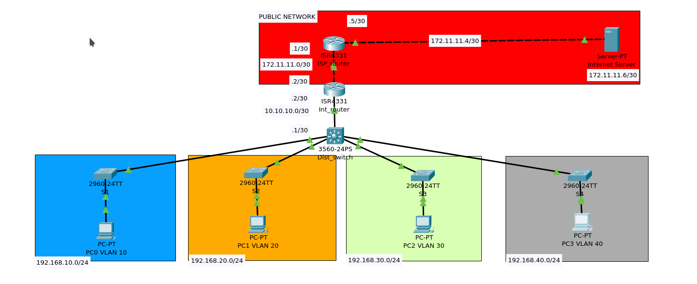

# 🌐 Small Office Network Topology Project (Cisco Packet Tracer)

## 🧩 Introduction
This project demonstrates a **small office enterprise network topology** implemented using **Cisco Packet Tracer**.  
It is designed for **simple management, scalability, and secure remote access**.  
The topology ensures **efficient IP utilization**, **secure segmentation using VLANs**, and **proper routing** for internet connectivity.

This project focuses on:
- **Proper Subnetting** – Prevents IP address wastage by allocating optimized subnets for each department/network.  
- **VLAN Implementation** – Provides logical separation of departments, improves security, reduces broadcast traffic, and simplifies network management.  
- **Routing** – Enables seamless communication between VLANs and ensures optimized packet flow to external networks (Internet).  
- **NAT Implementation** – Allows private IP addresses to access public networks using Network Address Translation.  
- **SSH Configuration** – Ensures secure remote management of routers and switches using encrypted sessions.

---

## 🗺️ Network Information

| Device Role          | Interface | IP Address       | Subnet Mask        | Description                  |
|----------------------|-----------|------------------|--------------------|------------------------------|
| **ISP Router**       | G0/0/0      | 172.11.11.1      | 255.255.255.252    | Connected to Internet Router |
| **Internet Router**  | G0/0/0      | 172.11.11.2      | 255.255.255.252    | Connected to ISP Router      |
| **Internet Router**  | G0/0/1      | 10.10.10.2       | 255.255.255.252    | Connected to Dist. Switch    |
| **Dist. Switch (L3)**| G0/1   | 10.10.10.1       | 255.255.255.252    | Gateway to Internal VLANs    |
| **Internet Server**  | NIC       | 172.11.11.6      | 255.255.255.252    | Public Internet Server       |

---

## 🧱 VLAN Information

| VLAN ID | VLAN Name | Network Address  | Subnet Mask     | Default Gateway   | Connected Switch | Purpose / Department     |
|----------|------------|------------------|-----------------|------------------|------------------|--------------------------|
| **10**   | VLAN10     | 192.168.10.0     | 255.255.255.0   | 192.168.10.254     | S1               | Department A (Users)     |
| **20**   | VLAN20     | 192.168.20.0     | 255.255.255.0   | 192.168.20.254     | S2               | Department B (Accounts)  |
| **30**   | VLAN30     | 192.168.30.0     | 255.255.255.0   | 192.168.30.254     | S3               | Department C (HR)        |
| **40**   | VLAN40     | 192.168.40.0     | 255.255.255.0   | 192.168.40.254     | S4               | Department D (Admin)     |
| **1**    | MGMT_VLAN  | 192.168.1.0      | 255.255.255.0   | 192.168.1.254    | Dist. Switch     | Management Network       |

---

## 🔐 Remote Management Information

| Device         | Management IP     | Subnet Mask       | Method | Description                         |
|----------------|-------------------|-------------------|---------|-------------------------------------|
| **ISP_router** | 2.2.2.2 | 255.255.255.255             | SSH     | Loopback IP for remote access        |
| **Int_router** | 1.1.1.1           | 255.255.255.255   | SSH     | Loopback IP for remote access       |
| **Dist_switch**| 192.168.1.254     | 255.255.255.0     | SSH     | VLAN 1 management interface         |
| **S1** | 192.168.1.10 | 255.255.255.0             | SSH     | VLAN 1 configured for secure access        |
| **S2** | 192.168.1.20 | 255.255.255.0             | SSH     | VLAN 1 configured for secure access        |
| **S3** | 192.168.1.30 | 255.255.255.0             | SSH     | VLAN 1 configured for secure access        |
| **S4** | 192.168.1.40 | 255.255.255.0             | SSH     | VLAN 1 configured for secure access        |

---

## ⚙️ Technologies Implemented

- **Subnetting**: Divided network into efficient subnets to reduce IP wastage.  
- **VLANs**: Enhanced security, segmentation, and broadcast control.  
- **Inter-VLAN Routing**: Implemented via Layer 3 switch.  
- **NAT**: Configured on Internet Router for private-to-public IP translation.  
- **SSH**: Secure remote access setup on all managed network devices.  

---

## 🖼️ Network Topology Diagram

Below is the visual representation of the complete network topology:

> *Cisco Packet Tracer's Logical Topology.*

---

## 📘 Summary
This topology showcases a **secure, scalable, and easily manageable** small office network model.  
By integrating VLANs, NAT, and SSH, it aligns with real-world enterprise network design practices suitable for **entry-level network engineering and cybersecurity learning projects**.

---
